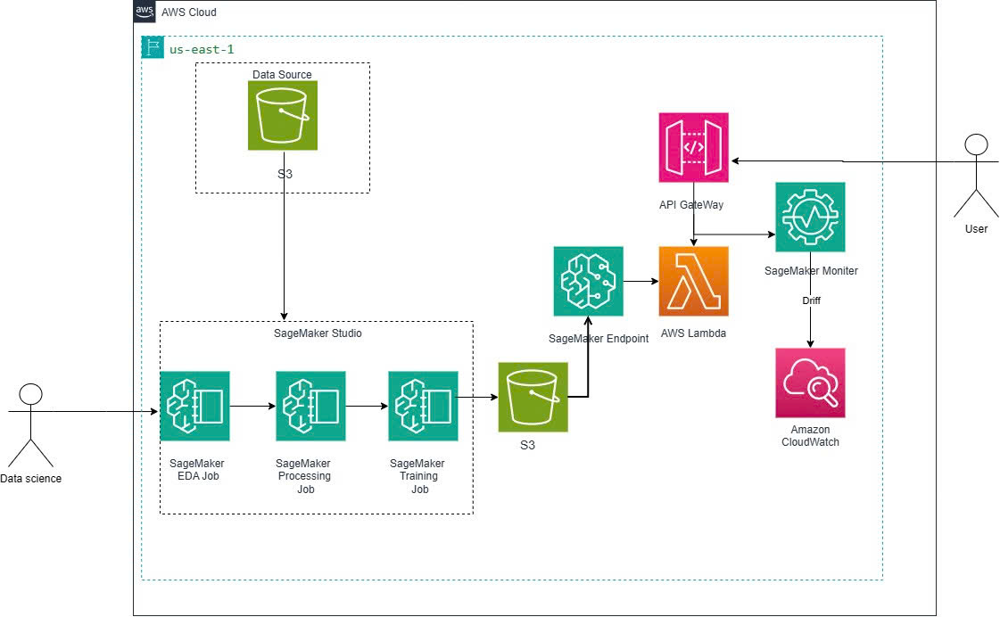

## 1. Tóm tắt điều hành

Dự án lập kế hoạch xây dựng proof of concept MLOps phục vụ học tập, chuyển thử nghiệm phân loại heart-risk trên notebook thành quy trình AWS có thể tái lập.

## 2. Bối cảnh và vấn đề

Notebook cục bộ thiếu tiền xử lý managed có thể tái lập, quản lý version mô hình, quality gate, real-time deployment, API, monitoring/cảnh báo và workflow pass/fail tự động.

## 3. Đối tượng sử dụng

- Sinh viên và kỹ sư học SageMaker MLOps
- Nhóm ML đánh giá một workflow PoC có thể tái lập
- Lập trình viên tích hợp API dự đoán phi lâm sàng

## 4. Mục tiêu và phạm vi

Phạm vi gồm dữ liệu có version, preprocessing chống leakage, LR/XGBoost và HPO, đánh giá cuối, Model Registry, một endpoint, Lambda/API Gateway, Data Capture, custom drift, CloudWatch, Pipeline, tài liệu và cleanup. Không gồm xác thực lâm sàng, chẩn đoán, production authentication, CI/CD, IaC, fairness hay automated retraining.

## 5. Đầu ra mong đợi

Dữ liệu/manifest S3 có version; bộ train/validation/test; artifact preprocessing/model; báo cáo HPO và đánh giá; Registry versions; model được duyệt và triển khai; endpoint/API; JSONL capture; drift report; metric/alarm; Pipeline pass/fail; runbook cleanup và minh chứng sau khi thực hiện.

## 6. Tiêu chí thành công

| Gate/check | Mục tiêu |
|---|---:|
| Test ROC-AUC | ≥ 0,84 |
| Test F1 | ≥ 0,70 |
| Test recall | ≥ 0,65 |
| API | xử lý 200, 400, 502 |
| Monitoring | custom metric và alarm |
| Pipeline | pass đăng ký; fail chặn |

## 7. Kiến trúc giải pháp

Sơ đồ kiến trúc do sinh viên tự dựng kết nối workflow SageMaker offline, luồng suy luận API online và monitoring. Đây là artifact kiến trúc dùng để nộp, không phải sơ đồ sinh tự động.

## 8. Dịch vụ AWS và lý do lựa chọn

| Dịch vụ | Lý do |
|---|---|
| Amazon S3 | Lưu bền raw/processed data, capture, report, artifact |
| SageMaker Processing/Training/HPO | Job tái lập, độc lập notebook |
| Model Registry | Version, metadata, phê duyệt thủ công |
| SageMaker Endpoint | Suy luận thời gian thực managed |
| Lambda và API Gateway | Wrapper validate và tích hợp HTTP |
| CloudWatch | Log, custom metric, alarm |
| SageMaker Pipeline | Workflow tự động có quality gate |
| AWS Budgets | Theo dõi và cảnh báo chi phí |

## 9. Phương pháp dữ liệu và ML

Dataset có 7.000 dòng, 22 cột. Loại `patient_id` còn 20 raw feature và target `heart_attack_risk` (~42% positive). Split phân tầng 70/15/15 tạo 4.900/1.050/1.050 dòng. Preprocessor chỉ fit trên train: numeric median imputation và scaling; categorical most-frequent imputation và one-hot encoding; tạo 36 feature, không còn missing.

## 10. Timeline 8 tuần

Tuần 1–3 onboarding, học nền tảng AWS và SageMaker; tuần 4 thiết lập môi trường dự án; tuần 5 xử lý dữ liệu; tuần 6 huấn luyện, đánh giá và đăng ký mô hình; tuần 7 triển khai, API và monitoring; tuần 8 tự động hóa Pipeline và hoàn thiện báo cáo. Thời gian thực hiện từ 15/06/2026 đến 15/08/2026.

## 11. Ngân sách và kiểm soát chi phí

Budget alert, tags, chỉ ba HPO trial tuần tự, một endpoint, tài nguyên dạng job và cleanup theo phụ thuộc giúp giới hạn chi phí. **Không tuyên bố tổng chi phí chính xác khi chưa có Cost Explorer.**

## 12. Rủi ro và giảm thiểu

| Rủi ro | Giảm thiểu |
|---|---|
| Data leakage | Split trước; fit preprocessing chỉ trên train |
| Role quá quyền | Trust policy riêng và quyền S3/endpoint có phạm vi |
| Chi phí endpoint | Một instance PoC; xóa sau khi lưu minh chứng |
| Thiếu official drift metric | Custom managed job và ngưỡng PoC rõ ràng |
| Diễn giải không an toàn | Disclaimer, limitation, không có claim/user lâm sàng |

## 13. Lợi ích mong đợi

Dự án minh họa khả năng tái lập, truy vết, monitoring vận hành, promotion có kiểm soát và automation an toàn khi thất bại.

## 14. Giới hạn đạo đức và y khoa

Dataset phi lâm sàng; chưa đánh giá fairness hay calibration xác suất. Không dùng dự đoán để hướng dẫn chăm sóc sức khỏe.

{}
Hệ thống chỉ phục vụ mục đích học tập và minh họa; không phải là chẩn đoán y khoa.
{}
