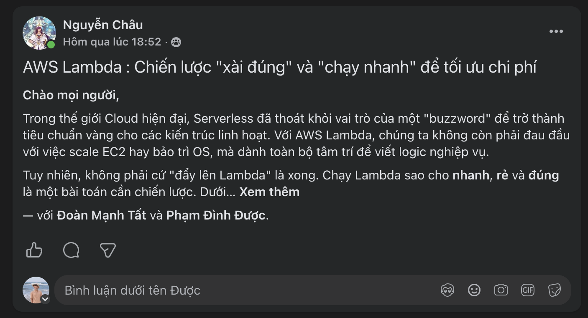

## Bài viết đã đăng

**Tiêu đề gốc:** AWS Lambda: Chiến lược “xài đúng” và “chạy nhanh” để tối ưu chi phí

Bài viết phân tích khi nào Lambda phù hợp—xử lý event-driven, API có traffic đột biến và scheduled job—cũng như khi nào workload chạy dài, stateful hoặc yêu cầu độ trễ cực thấp cần dịch vụ khác.

## Nội dung chính

- Tái sử dụng execution environment bằng cách khởi tạo SDK và database client ngoài handler.
- Tuning memory vì tăng memory cũng làm tăng CPU khả dụng.
- Giảm cold start và chỉ dùng Provisioned Concurrency khi yêu cầu latency đủ bù chi phí liên tục.
- Giữ deployment package nhỏ và dùng Lambda Layers phù hợp.
- Dùng RDS Proxy để bảo vệ relational database trước connection burst.
- Monitoring bằng AWS X-Ray, CloudWatch và custom metric.
- Thiết kế xử lý lỗi với SQS dead-letter queue và nắm concurrency limit.

## Liên hệ với dự án thực tập

Các thực hành này áp dụng cho Lambda wrapper `heart-risk-api`: tái sử dụng SageMaker Runtime client, validate gọn nhẹ, cấp quyền `InvokeEndpoint` tối thiểu, monitor lỗi và tránh tài nguyên tính phí liên tục nếu yêu cầu latency chưa cần.

## Trạng thái xuất bản

- **Trạng thái:** Đã đăng trong AWS Study Group VN
- **Ngày đăng:** 29/06/2026
- **Bài Facebook:** [Đọc bài AWS Lambda đã đăng](https://www.facebook.com/groups/660548818043427/?multi_permalinks=2227143931383900&hoisted_section_header_type=recently_seen)
- **Attribution:** bài viết hiển thị Nguyễn Châu và gắn thẻ Phạm Đình Được

Ảnh được cung cấp ghi nhận tiêu đề bài viết và attribution hiển thị trên Facebook:

<figure class="evidence">
  
  <figcaption>Bài tối ưu AWS Lambda đã đăng trong AWS Study Group VN — <code>blog1-facebook-post.png</code></figcaption>
</figure>

**Minh chứng xuất bản:** ảnh hiển thị bài Lambda đã đăng và việc gắn thẻ Phạm Đình Được.

## Lưu ý chi phí và bảo mật

Provisioned Concurrency, log retention và downstream service vẫn có thể phát sinh phí khi số request Lambda thấp. Không nhúng credential trong code hoặc biến môi trường.
