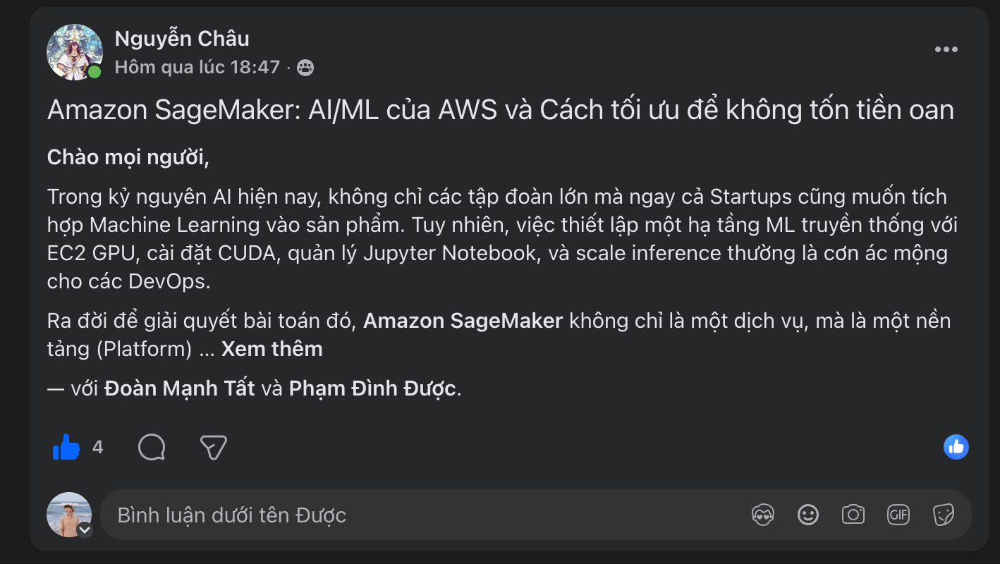

## Bài viết đã đăng

**Tiêu đề gốc:** Amazon SageMaker: AI/ML của AWS và Cách tối ưu để không tốn tiền oan

Bài viết trình bày SageMaker như một platform gồm Studio, managed Training Job và inference hosting, thay vì chỉ là notebook trên cloud.

## Nội dung chính

- Tách thử nghiệm Studio khỏi managed training và inference.
- Cân nhắc Managed Spot Training có checkpoint cho workload chấp nhận gián đoạn.
- Giới hạn số HPO job và mức song song trước khi mở rộng search.
- Chọn CPU/GPU instance phù hợp thuật toán và dataset.
- Xem endpoint thời gian thực chạy liên tục là rủi ro chi phí chính.
- Đánh giá Auto Scaling, Serverless Inference, quantization và SageMaker Neo theo traffic/latency.
- Dùng SageMaker Pipelines, Model Registry, staging và deployment có kiểm soát cho MLOps.

## Liên hệ với dự án thực tập

Heart-risk PoC áp dụng nhiều nguyên tắc: managed job thay training phụ thuộc notebook, ba HPO trial tuần tự, một endpoint instance, Model Registry/phê duyệt thủ công, quality gate, Pipeline automation, Budget alert và runbook cleanup rõ ràng.

## Trạng thái xuất bản

- **Trạng thái:** Đã đăng trong AWS Study Group VN
- **Ngày đăng:** 29/06/2026
- **Bài Facebook:** [Đọc bài Amazon SageMaker đã đăng](https://www.facebook.com/groups/awsstudygroupfcj/posts/2227364341361859/?notif_id=1785325679108331&notif_t=tagged_with_story&ref=notif)
- **Attribution:** bài viết hiển thị Nguyễn Châu và gắn thẻ Phạm Đình Được

Ảnh được cung cấp ghi nhận tiêu đề bài viết và attribution hiển thị trên Facebook:

<figure class="evidence">
  
  <figcaption>Bài tối ưu chi phí Amazon SageMaker đã đăng trong AWS Study Group VN — <code>blog2-facebook-post.png</code></figcaption>
</figure>

**Minh chứng xuất bản:** ảnh hiển thị bài SageMaker đã đăng và việc gắn thẻ Phạm Đình Được.

## Lưu ý chi phí và bảo mật

Kỹ thuật tiết kiệm chi phí cần được kiểm chứng theo độ tin cậy và latency của workload. IAM role, lưu dữ liệu private, thí nghiệm có giới hạn, monitoring và cleanup vẫn bắt buộc.
