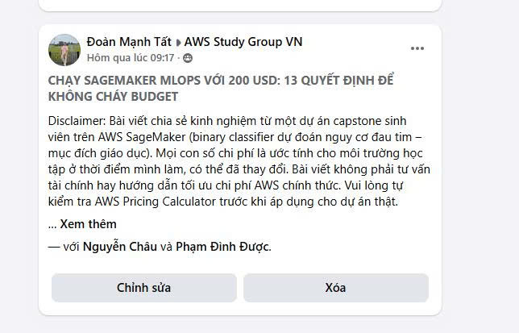

## Bài viết đã gửi

**Tiêu đề gốc:** Chạy SageMaker MLOps với 200 USD: 13 quyết định để không cháy budget

Bài viết tổng hợp các kinh nghiệm kiểm soát chi phí từ đồ án Heart Risk trên SageMaker. Thông điệp chính là chi phí cloud không chỉ phụ thuộc khối lượng công việc, mà còn tăng nhanh khi tài nguyên bị để quên, thí nghiệm dùng cấu hình quá lớn, thiếu lifecycle rule hoặc không lập kế hoạch cleanup.

Các con số trong bài là ước tính phục vụ môi trường học tập tại thời điểm thực hiện dự án và có thể thay đổi. Người đọc cần kiểm tra lại bằng AWS Pricing Calculator trước khi áp dụng cho hệ thống thực tế.

## Mười ba quyết định

### Compute

1. Benchmark instance nhỏ trước khi nâng cấu hình.
2. Không sử dụng GPU khi thuật toán và dataset không yêu cầu.
3. Giữ PoC sinh viên trong một AWS Region.
4. Xóa real-time endpoint ngay sau khi demo.

### Data và lưu trữ

5. Cấu hình S3 lifecycle cho log và artifact tạm thời.
6. Tái sử dụng dataset đã xử lý thay vì lặp lại preprocessing không thay đổi.
7. Không retrain chỉ để đổi lấy mức cải thiện không có ý nghĩa thực tế.
8. Gắn tag project, owner, environment và thông tin cleanup cho tài nguyên.

### Pipeline và training

9. Giới hạn số lượng HPO job và mức song song.
10. Thực hiện checklist hoặc cleanup script định kỳ.
11. Dùng SageMaker Training Job có vòng đời hữu hạn thay vì giữ notebook compute chạy để training.

### IAM và network

12. Áp dụng IAM least privilege thay cho `AdministratorAccess`.
13. Không tạo NAT Gateway khi kiến trúc không cần; đánh giá VPC endpoint hoặc public access phù hợp.

## Liên hệ với dự án thực tập

Dự án đã áp dụng HPO có giới hạn, managed job, một endpoint cho PoC, budget alert, IAM role, output có tag/phiên bản và cleanup runbook. Bài viết nhấn mạnh bài học quan trọng trong kỳ thực tập: cleanup, lifecycle và kiểm soát chi phí phải được thiết kế cùng tài nguyên, không nên chờ đến khi hoàn thành mới bổ sung.

Các chi phí nêu trong bài chỉ là ước tính, không phải cam kết hóa đơn AWS. Khả dụng của instance và mức giá thay đổi theo Region, chế độ dịch vụ và thời điểm.

## Trạng thái xuất bản

- **Trạng thái:** **Chờ duyệt**
- **URL công khai:** Chưa có trong thời gian bài viết đang chờ cộng đồng phê duyệt
- **Minh chứng gửi bài:** ảnh Facebook được cung cấp hiển thị tiêu đề bài viết và tên Đoàn Mạnh Tất, Nguyễn Châu, Phạm Đình Được

<figure class="evidence">
  
  <figcaption>Blog 3 đã gửi AWS Study Group VN và đang chờ duyệt — <code>blog3-facebook-pending-review.jpg</code></figcaption>
</figure>

Ảnh xác nhận bài đã được gửi, không được dùng để khẳng định bài đã xuất bản công khai hoặc đã có permalink.
