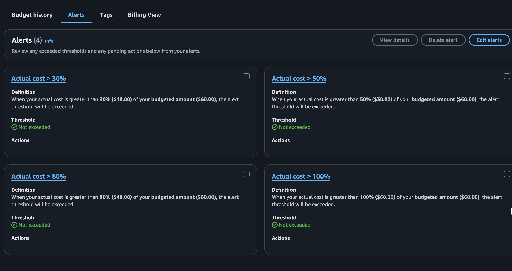
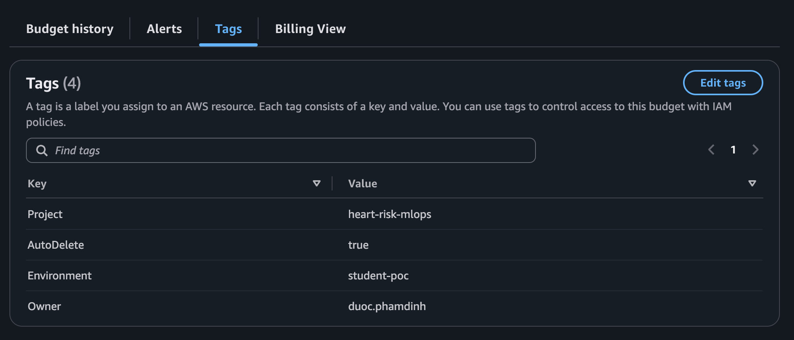
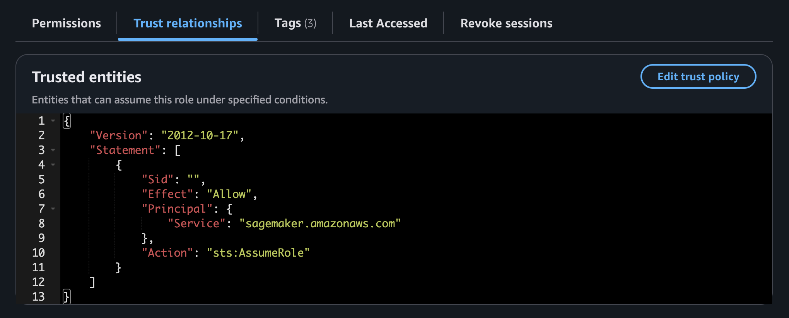
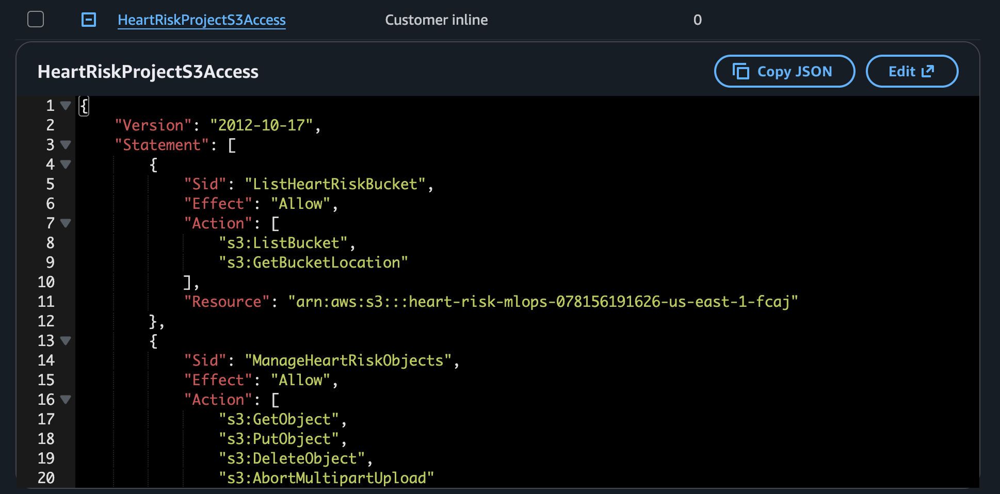
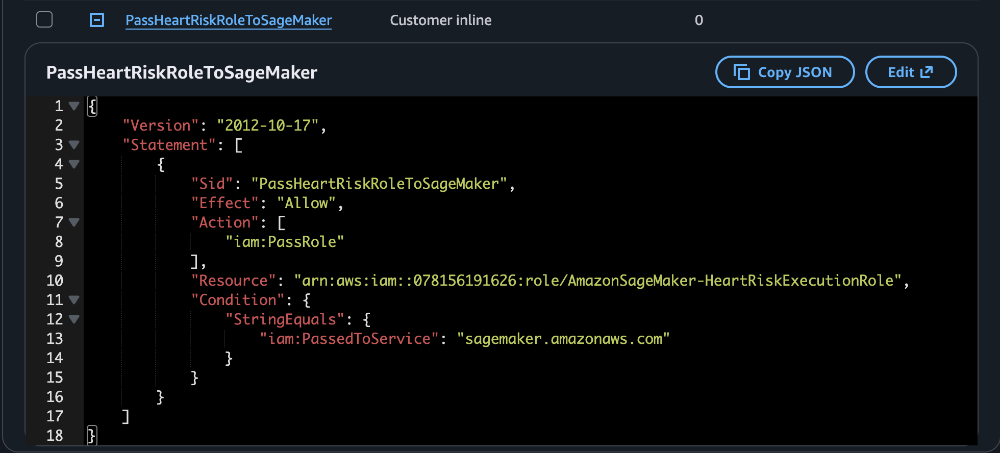
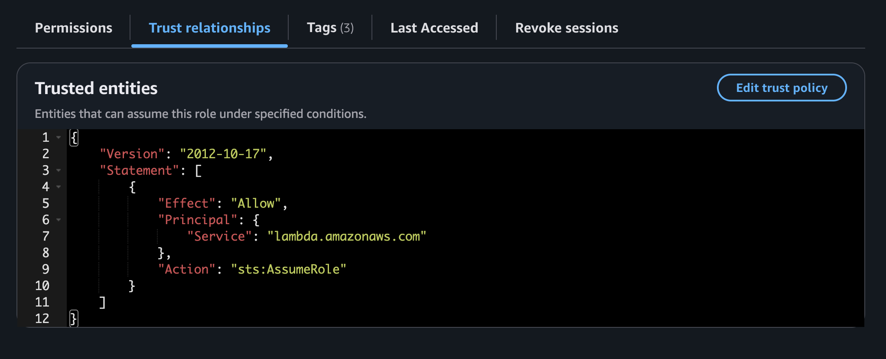
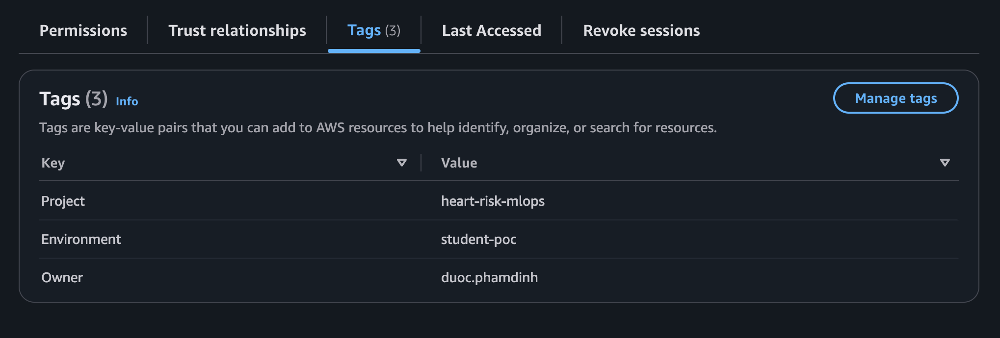

## Kiểm soát đã hiện thực

- Dùng IAM role thay access key; tách trust policy SageMaker/Lambda.
- Quyền S3 của SageMaker giới hạn ở bucket/prefix dự án; `iam:PassRole` giới hạn theo nhu cầu managed job.
- Lambda giới hạn `sagemaker:InvokeEndpoint` trên endpoint cần thiết.
- S3 private; không dùng dữ liệu bệnh nhân/private; ảnh public phải che account ID, URL active và ARN nhạy cảm.
- Budget/alert, project tags, ba HPO trial, một endpoint và compute dạng job.

Minh chứng cần có `AWS-02/03/07–14` chứng minh budget, tag, role permission/trust và policy có phạm vi khi được bổ sung. Ảnh cấu hình không chứng minh tổng chi phí nên không tuyên bố con số.

```bash
aws sagemaker list-endpoints --region "$AWS_REGION"
aws cloudwatch describe-alarms --region "$AWS_REGION"
```

Endpoint là tài nguyên chính tính phí liên tục; Processing/Training/HPO tính phí khi chạy, S3/log/metric cũng có phí. Giữ minh chứng trước cleanup rồi xóa compute.

**Xử lý lỗi:** sửa AccessDenied bằng cách xác định đúng action/resource bị từ chối, không thêm administrator access.

Tiếp theo: [Cleanup](../5.11-Cleanup/).

## Minh chứng và diễn giải kỹ thuật

Các ảnh dự án được cung cấp dưới đây liên kết cấu hình đã mô tả với trạng thái AWS quan sát được.

Ảnh tiếp theo ghi nhận **budget alert được cấu hình để kiểm soát chi phí**.

<figure class="evidence">
  
  <figcaption>Budget alert được cấu hình để kiểm soát chi phí — <code>AWS-03-budget-alerts.png</code></figcaption>
</figure>

**Ý nghĩa kỹ thuật:** Ngưỡng alert cung cấp guardrail thông báo; bản thân chúng không chứng minh tổng chi phí.

Ảnh tiếp theo ghi nhận **project tag được gắn cho tài nguyên s3**.

<figure class="evidence">
  
  <figcaption>Project tag được gắn cho tài nguyên S3 — <code>AWS-07-s3-tags.png</code></figcaption>
</figure>

**Ý nghĩa kỹ thuật:** Tag hỗ trợ xác định ownership và cost/governance giữa các tài nguyên.

Ảnh tiếp theo ghi nhận **trust relationship của sagemaker execution role**.

<figure class="evidence">
  
  <figcaption>Trust relationship của SageMaker execution role — <code>AWS-09-sagemaker-role-trust.png</code></figcaption>
</figure>

**Ý nghĩa kỹ thuật:** Trust policy giới hạn việc assume role cho SageMaker thay vì principal tùy ý.

Ảnh tiếp theo ghi nhận **policy truy cập s3 của sagemaker role**.

<figure class="evidence">
  
  <figcaption>Policy truy cập S3 của SageMaker role — <code>AWS-10-sagemaker-s3-policy.png</code></figcaption>
</figure>

**Ý nghĩa kỹ thuật:** Policy ghi nhận phạm vi storage cần cho data, artifact, report và capture.

Ảnh tiếp theo ghi nhận **policy iam:passrole có phạm vi cho managed job**.

<figure class="evidence">
  
  <figcaption>Policy iam:PassRole có phạm vi cho managed job — <code>AWS-11-sagemaker-passrole-policy.png</code></figcaption>
</figure>

**Ý nghĩa kỹ thuật:** PassRole có phạm vi cho phép managed job mà không cấp quyền truyền role quá rộng.

Ảnh tiếp theo ghi nhận **trust relationship của lambda execution role**.

<figure class="evidence">
  
  <figcaption>Trust relationship của Lambda execution role — <code>AWS-13-lambda-role-trust.png</code></figcaption>
</figure>

**Ý nghĩa kỹ thuật:** Trust relationship xác lập Lambda, không phải client, là principal assume wrapper role.

Ảnh tiếp theo ghi nhận **policy lambda gọi endpoint theo đặc quyền tối thiểu**.

<figure class="evidence">
  
  <figcaption>Policy Lambda gọi endpoint theo đặc quyền tối thiểu — <code>AWS-14-lambda-invoke-policy.png</code></figcaption>
</figure>

**Ý nghĩa kỹ thuật:** Policy giới hạn Lambda ở quyền gọi endpoint cần thiết thay vì quản trị SageMaker chung.
