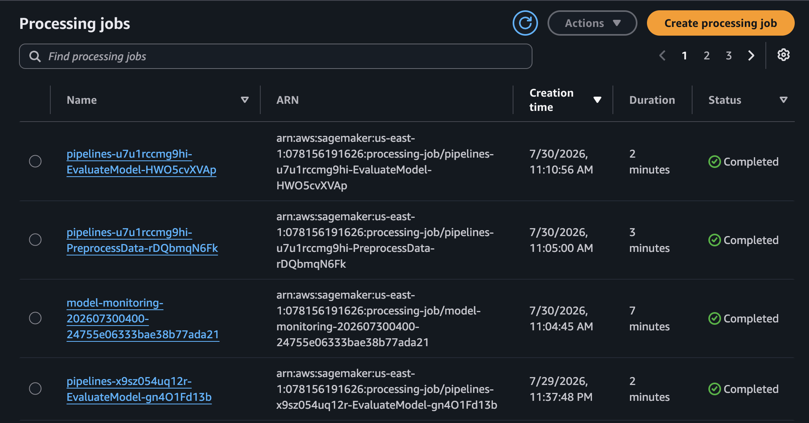
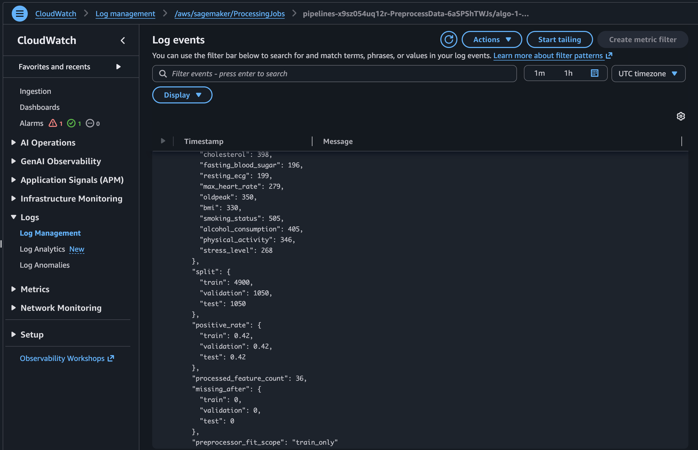
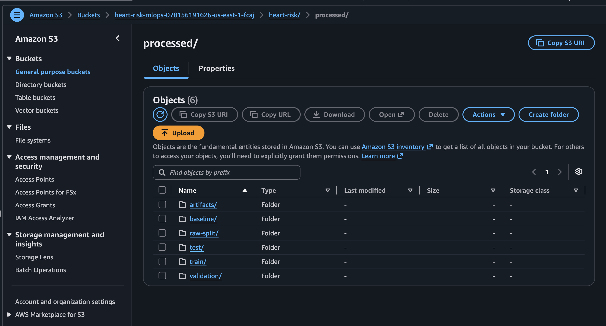

## Mục tiêu

Tạo train/validation/test có thể tái lập mà không leakage.

```python
# Pseudocode: split before fitting transformations
train, temp = stratified_split(raw, train_size=0.70, target="heart_attack_risk")
validation, test = stratified_split(temp, train_size=0.50, target="heart_attack_risk")
preprocessor.fit(train[feature_columns])  # fit_scope = "train_only"
```

Numeric missing dùng median imputation và scaling; categorical dùng most-frequent imputation và one-hot encoding. Loại `patient_id`.

| Kiểm tra | Kỳ vọng |
|---|---:|
| Số dòng split | 4,900 / 1,050 / 1,050 |
| Feature raw/processed | 20 / 36 |
| Missing sau xử lý | 0 |
| Phạm vi fit | `train_only` |

Minh chứng `W2-01`, `W2-02` và `W2-03` lần lượt xác nhận managed job hoàn tất, quality check trong log và output S3. Các ảnh được cung cấp được hiển thị và diễn giải bên dưới.

**Xử lý lỗi:** feature count lệch thường do category vocabulary hoặc cột loại trừ thay đổi. Không refit trên validation/test. Dừng job lỗi và đọc CloudWatch log để kiểm soát phí.

Tiếp theo: [Huấn luyện mô hình](../../5.5-Model-Training/).

## Minh chứng và diễn giải kỹ thuật

Các ảnh dự án được cung cấp dưới đây liên kết cấu hình đã mô tả với trạng thái AWS quan sát được.

Ảnh tiếp theo ghi nhận **sagemaker processing job managed đã hoàn tất**.

<figure class="evidence">
  
  <figcaption>SageMaker Processing Job managed đã hoàn tất — <code>W2-01-processing-completed.png</code></figcaption>
</figure>

**Ý nghĩa kỹ thuật:** Trạng thái hoàn tất chứng minh preprocessing chạy trên hạ tầng managed, không chỉ trong notebook local.

Ảnh tiếp theo ghi nhận **log processing với kết quả split và kiểm tra chất lượng**.

<figure class="evidence">
  
  <figcaption>Log Processing với kết quả split và kiểm tra chất lượng — <code>W2-02-processing-log.png</code></figcaption>
</figure>

**Ý nghĩa kỹ thuật:** Log xác minh 4.900/1.050/1.050 dòng, 36 feature, không còn missing và fit train-only.

Ảnh tiếp theo ghi nhận **dataset và artifact sau xử lý được lưu trên amazon s3**.

<figure class="evidence">
  
  <figcaption>Dataset và artifact sau xử lý được lưu trên Amazon S3 — <code>W2-03-processed-s3.png</code></figcaption>
</figure>

**Ý nghĩa kỹ thuật:** Output được lưu giúp training và evaluation tái lập, không phụ thuộc bộ nhớ notebook.
