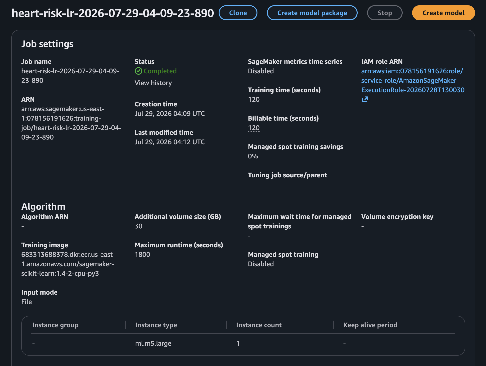
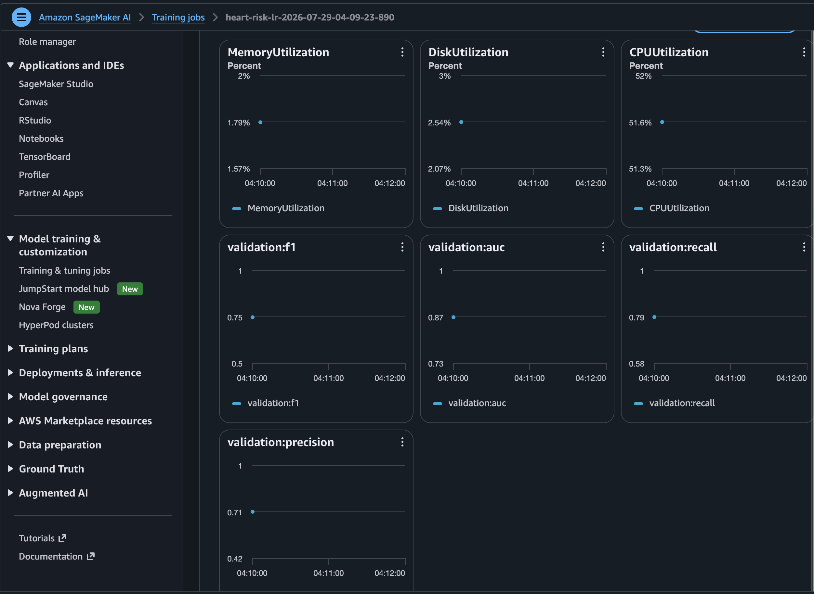

## Mục tiêu và lý do

Train baseline tuyến tính dễ diễn giải bằng managed job, độc lập phiên notebook.

```text
validation ROC-AUC = 0.863949
F1 = 0.747583; recall = 0.789116; precision = 0.710204
decision threshold = 0.36
```

`W3-01` cần chứng minh trạng thái/cấu hình job và `W3-02` các validation metric; các ảnh được cung cấp xác nhận hai kết quả. Threshold 0,36 thuộc artifact được đánh giá, không phải ngưỡng y khoa.

**Kỳ vọng:** model artifact trên S3 và metric được ghi để so sánh. Nếu không parse được metric, kiểm tra log regex/channel. Training job tính phí theo instance-time và role chỉ được truy cập prefix cần thiết.

Tiếp theo: [XGBoost](../5.5.2-XGBoost/).

## Minh chứng và diễn giải kỹ thuật

Các ảnh dự án được cung cấp dưới đây liên kết cấu hình đã mô tả với trạng thái AWS quan sát được.

Ảnh tiếp theo ghi nhận **training job logistic regression managed**.

<figure class="evidence">
  
  <figcaption>Training job Logistic Regression managed — <code>W3-01-lr-training.png</code></figcaption>
</figure>

**Ý nghĩa kỹ thuật:** Trạng thái và cấu hình tạo bằng chứng cho lần huấn luyện managed có thể truy vết.

Ảnh tiếp theo ghi nhận **validation metric của logistic regression**.

<figure class="evidence">
  
  <figcaption>Validation metric của Logistic Regression — <code>W3-02-lr-metrics.png</code></figcaption>
</figure>

**Ý nghĩa kỹ thuật:** Các metric hỗ trợ lựa chọn theo validation AUC và ghi nhận threshold 0,36.
