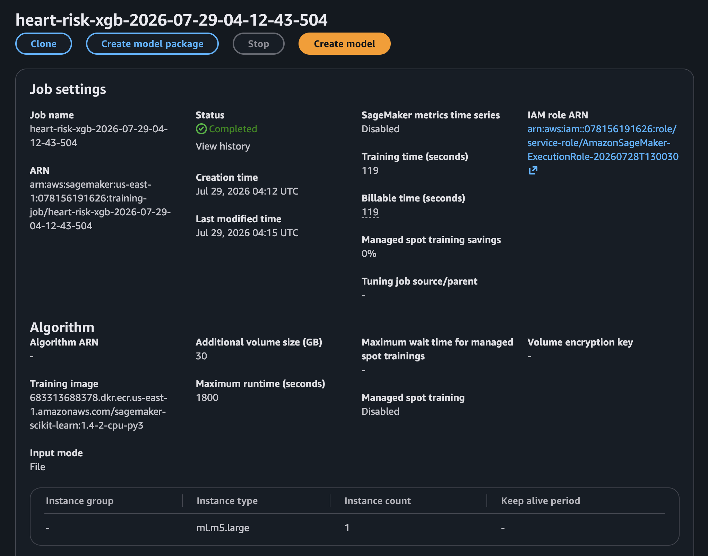
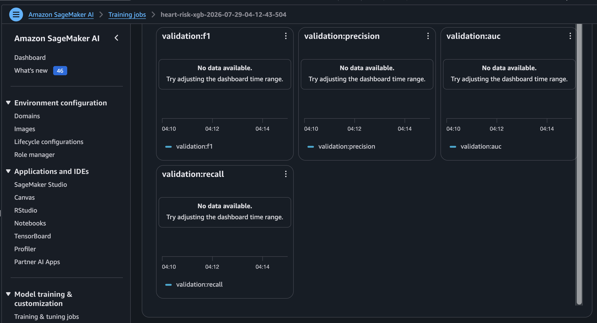

## Mục tiêu và so sánh

Thử model dạng cây có thể học tương tác phi tuyến.

| Model | AUC | F1 | Recall | Precision |
|---|---:|---:|---:|---:|
| Logistic Regression | 0.863949 | 0.747583 | 0.789116 | 0.710204 |
| XGBoost default | 0.854283 | 0.749749 | 0.845805 | 0.673285 |

XGBoost tăng recall nhưng giảm precision và primary selection metric AUC. `W3-03` cần chứng minh managed job và `W3-04` metric; các ảnh được cung cấp xác nhận hai kết quả.

**Kỳ vọng:** artifact có version độc lập, không overwrite LR. Nếu input XGBoost lỗi, kiểm tra vị trí label/content type. Giới hạn job và chỉ xóa artifact tạm sau khi giữ minh chứng.

Tiếp theo: [HPO](../5.5.3-HPO/).

## Minh chứng và diễn giải kỹ thuật

Các ảnh dự án được cung cấp dưới đây liên kết cấu hình đã mô tả với trạng thái AWS quan sát được.

Ảnh tiếp theo ghi nhận **training job xgboost managed**.

<figure class="evidence">
  
  <figcaption>Training job XGBoost managed — <code>W3-03-xgb-training.png</code></figcaption>
</figure>

**Ý nghĩa kỹ thuật:** Job riêng chứng minh thuật toán thứ hai được huấn luyện như ứng viên độc lập.

Ảnh tiếp theo ghi nhận **validation metric của xgboost mặc định**.

<figure class="evidence">
  
  <figcaption>Validation metric của XGBoost mặc định — <code>W3-04-xgb-metrics.png</code></figcaption>
</figure>

**Ý nghĩa kỹ thuật:** Kết quả ghi nhận recall cao hơn nhưng precision và ROC-AUC thấp hơn Logistic Regression.
