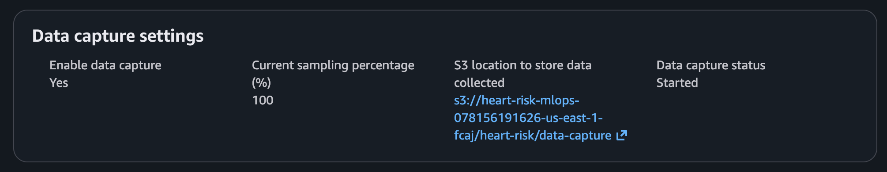
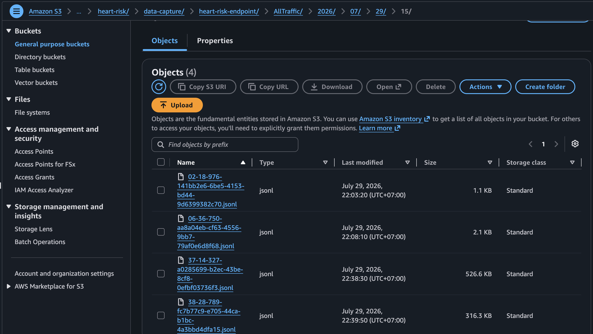
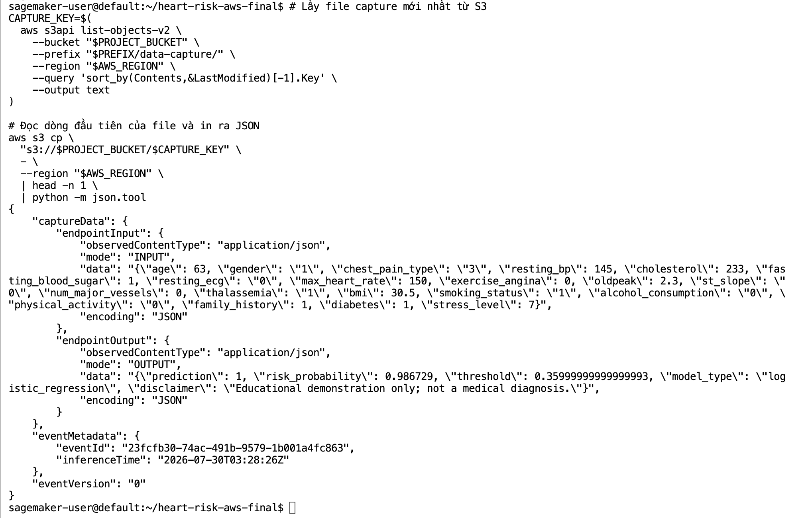

Bật capture 100% input/output dạng JSONL vào prefix S3 private của dự án.

```text
EnableCapture=true
InitialSamplingPercentage=100
CaptureOptions=[Input, Output]
```

Record thật chứa `endpointInput`, `endpointOutput`, `eventMetadata`, and `inferenceTime`. `W6-02` cần chứng minh cấu hình, `W6-12` chứng minh file được tạo, và `W6-13` chứng minh nội dung record. Chỉ có cấu hình chưa chứng minh traffic đã được capture.

**Kỳ vọng:** invocation mới tạo object JSONL theo timestamp. Nếu không có, kiểm tra destination, endpoint config, permission, traffic và độ trễ. Payload capture có thể nhạy cảm: dùng dữ liệu synthetic/không riêng tư, S3 private, retention và giới hạn reader.

Tiếp theo: [Monitoring](../../5.8-Monitoring/).

## Minh chứng và diễn giải kỹ thuật

Các ảnh dự án được cung cấp dưới đây liên kết cấu hình đã mô tả với trạng thái AWS quan sát được.

Ảnh tiếp theo ghi nhận **data capture được cấu hình 100% input và output**.

<figure class="evidence">
  
  <figcaption>Data Capture được cấu hình 100% input và output — <code>W6-02-data-capture-config.png</code></figcaption>
</figure>

**Ý nghĩa kỹ thuật:** Endpoint configuration xác lập cấu hình capture và S3 destination.

Ảnh tiếp theo ghi nhận **các file jsonl inference capture lưu trong s3**.

<figure class="evidence">
  
  <figcaption>Các file JSONL inference capture lưu trong S3 — <code>W6-12-capture-files.png</code></figcaption>
</figure>

**Ý nghĩa kỹ thuật:** Object được tạo chứng minh invocation thật sinh dữ liệu capture, không chỉ có cấu hình.

Ảnh tiếp theo ghi nhận **record capture chứa input và output endpoint**.

<figure class="evidence">
  
  <figcaption>Record capture chứa input và output endpoint — <code>W6-13-capture-record.png</code></figcaption>
</figure>

**Ý nghĩa kỹ thuật:** Cấu trúc record xác minh endpointInput, endpointOutput, metadata và inference time sẵn sàng cho monitoring.
