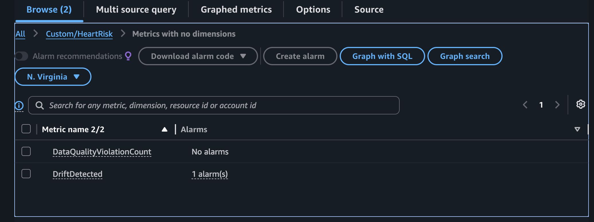
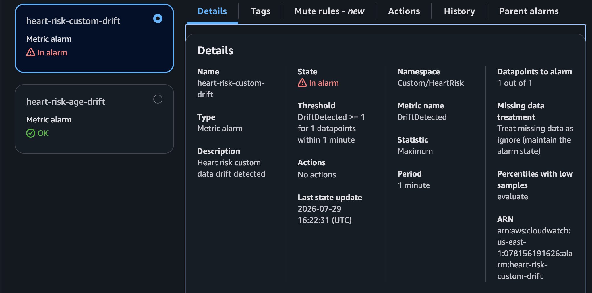

# CloudWatch metrics and alarm

Publish kết quả batch vào namespace `Custom/HeartRisk`:

```text
DriftDetected = 1
DataQualityViolationCount = 6
```

Cấu hình `heart-risk-custom-drift` chuyển sang `ALARM` khi `DriftDetected` vượt ngưỡng, với `TreatMissingData=ignore`.

```bash
aws cloudwatch describe-alarms   --alarm-names heart-risk-custom-drift --region "$AWS_REGION"
```

`W7-04` cần chứng minh hai custom metric; `W7-05` the `ALARM` state. Sparse batch metrics originally left/reset the state khi empty periods were treated as non-breaching; ignoring missing periods and publishing a fresh datapoint resolved it.

**Lỗi/bảo mật/chi phí:** dùng `describe-alarms` nếu bị từ chối `DescribeAlarmHistory`; chỉ cấp quyền history khi cần. Giữ dimension ổn định và không đưa dữ liệu nhạy cảm vào dimension. Metric/alarm có phí.

Tiếp theo: [Pipeline](../../5.9-Pipeline/).

## Minh chứng và diễn giải kỹ thuật

Các ảnh dự án được cung cấp dưới đây liên kết cấu hình đã mô tả với trạng thái AWS quan sát được.

Ảnh tiếp theo ghi nhận **drift metric custom/heartrisk trong cloudwatch**.

<figure class="evidence">
  
  <figcaption>Drift metric Custom/HeartRisk trong CloudWatch — <code>W7-04-custom-metrics.png</code></figcaption>
</figure>

**Ý nghĩa kỹ thuật:** Metric view chứng minh DriftDetected và DataQualityViolationCount được publish thay cho official feature metric không xuất hiện.

Ảnh tiếp theo ghi nhận **custom drift alarm ở trạng thái alarm**.

<figure class="evidence">
  
  <figcaption>Custom drift alarm ở trạng thái ALARM — <code>W7-05-custom-alarm.png</code></figcaption>
</figure>

**Ý nghĩa kỹ thuật:** Trạng thái ALARM xác minh custom metric tạo tín hiệu vận hành khi period thiếu thưa được ignore.
